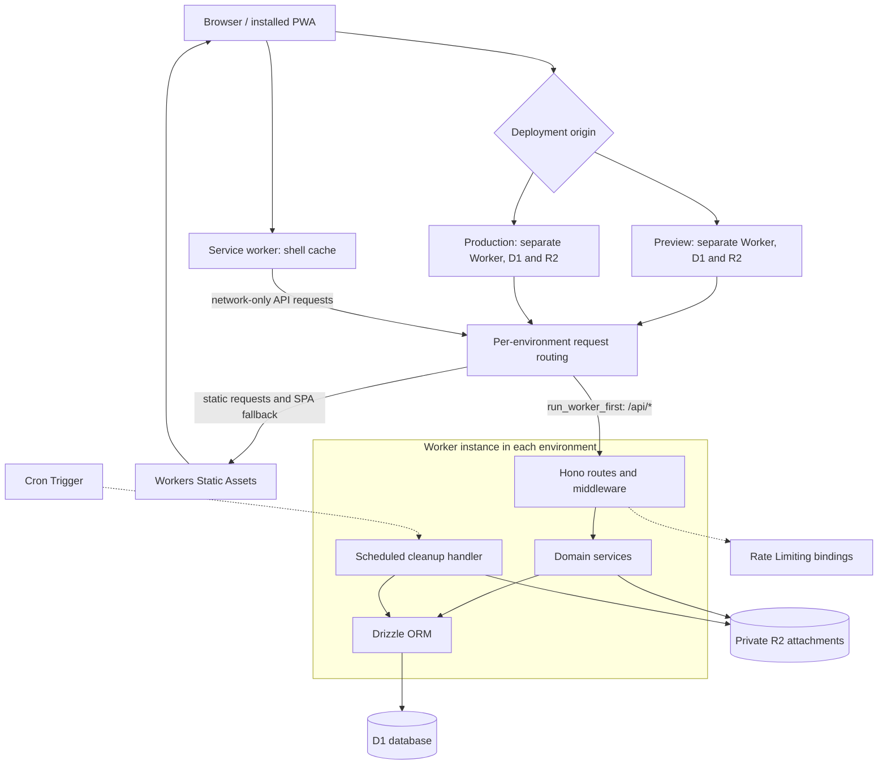

# Project Architecture

Pattern: monolith. One Cloudflare Worker serves the Hono API and the SPA through Workers Static Assets.

## Design Principles

### Principle 1

Description: isolate personal training data by user.  
Reasoning: explicit user IDs in services and queries keep personal endpoints within the authenticated account; [RBAC](../foundation.md#personas) defines exceptions.

### Principle 2

Description: one deployment is one team; all coaches share all athletes.  
Reasoning: `invited_by` records provenance rather than creating separate rosters or access boundaries.

### Principle 3

Description: coach responses contain only plan and aggregate data, plus team data coaches write themselves.  
Reasoning: private logs must never reach coaches. `getCoachOverview` and the team overview `getCoachTeamOverview` enforce the boundary with dedicated plan and aggregate queries that never select private log columns (see [security](security.md#api-security)). Team meals are team-level rows that coaches write and athletes read; coaches never read athletes' own inspiration. Coaches themselves have no personal training data.

### Principle 4

Description: use single statements or D1 `batch()`, never `transaction()`, for atomic writes.  
Reasoning: D1 rejects interactive transactions. Bootstrap uses a conditional insert; invite claims and score/ends inserts use batches. R2 is outside D1 atomicity.

### Principle 5

Description: `src/db/schema.ts` is the schema source of truth.  
Reasoning: drizzle-kit generates SQL and snapshots; the no-diff check detects drift. Data-preserving rebuilds still require review under the [migration procedure](../devops/operations.md#ongoing-operations).

### Principle 6

Description: Cloudflare-native runtime APIs only.  
Reasoning: WebCrypto, D1 and R2 run in Workers without Node compatibility. Local test-runner compatibility does not permit Node APIs in application code.

### Principle 7

Description: the API is the source of truth; the PWA caches the shell.  
Reasoning: network-only API requests avoid stale training data and competing offline copies. There is no offline write queue or sync.

## High-level Architecture:

Each environment below is a separate instance of the same stack; bindings and deployment names are in [infrastructure](../devops/infrastructure.md).

## Major Components

### Component 1:

Name: Worker entry/router  
Purpose: route requests and normalize errors.  
Description and Scope: `src/index.ts` mounts `routes/auth.ts` at `/api/auth`, `routes/coach.ts` at `/api/coach`, and `routes/tracker.ts` plus `routes/transfer.ts` at `/api`. It exports `fetch` and `scheduled`, with outer API security headers, the same-origin guard, JSON not-found and public-error handling. `lib/http.ts` owns validators, integer parsing and download filename construction; `scheduled` delegates to `services/cleanup.ts` for [bounded cleanup and size backfill](../devops/operations.md#scheduled-cleanup-jobs).

### Component 2:

Name: auth & sessions  
Purpose: credentials, invitations and access checks.  
Description and Scope: `lib/auth.ts` provides WebCrypto and cookies, `lib/rbac.ts` provides authentication and coach/athlete guards, and `services/auth.ts` owns account/session/invite persistence. Authentication joins sessions and users in one query. [Security](security.md) owns cryptographic and access-enforcement details.

### Component 3:

Name: rate limiting  
Purpose: bound authentication, password verification, invitations, uploads and team meal writes.  
Description and Scope: `lib/rate-limit.ts` selects the native Workers bindings. Operation keys, approximate counters and fail-closed behavior are in [security](security.md#rate-limiting).

### Component 4:

Name: tracker services  
Purpose: implement personal training operations for athletes.  
Description and Scope: `services/plan.ts`, `sessions.ts`, `scores.ts`, `maintenance.ts`, `setups.ts`, `inspiration.ts` and `dashboard.ts` take explicit account IDs. `routes/tracker.ts` and `routes/transfer.ts` gate every personal route with `requireAthlete`, except the shared file download. Shared schemas and date functions live in `lib/validation.ts` and `lib/dates.ts`; `recipeInput` holds the recipe field rules shared by inspiration and team meals.

The tracker payload's `recipes[]` merges the athlete's own inspiration recipes with every team meal (`team-meals.listTeamMealRecipes`), newest first, tagged with `source` and a collision-free `key`. Team meals never affect `inspiration`.

The dashboard returns at most 100 sessions, ordered by date then ID descending, with [cursor pagination](apis.md#design). It returns at most 100 practice scores; ends are queried only for those IDs in groups of 50. SQL computes weekly arrow sums and distinct session dates from the first program cycle through the current cycle's end. Cycle summaries and other collections still grow with program/history size; this is not a constant-size payload guarantee.

New-state and starter-plan presentation is described in [experience](../uxui/experience.md#regular-usage). Maintenance insertion computes `MAX(sort_order)+1` within its insert; section clearing is one insert-select upsert. Score creation batches the parent and ends, locating the new parent through `sqlite_sequence` within the batch and checking its user ID rather than using global `max(id)`.

### Component 5:

Name: coach routes  
Purpose: shared team roster, team overview, athlete plan editing and team meals.  
Description and Scope: `routes/coach.ts` uses `services/team.ts`, the plan/attachment services, `services/team-meals.ts`, `dashboard.getCoachOverview` and `dashboard.getCoachTeamOverview`. Athlete-targeted calls require `resolveAthlete`. The per-athlete overview exposes `state`, `weeklyPlans`, `plannedSessions`, `weeklyArrows` and `cycleSummaries`; their query-level privacy rule is in [security](security.md#api-security).

The team overview (coach Today) reads the active roster once, then batches athlete IDs in chunks of 90 (below D1's 100-parameter limit), running three grouped queries per chunk: program state, weekly arrow sums with session counts, and distinct session dates, over one shared date window. That is 1 + 3 × ⌈N/90⌉ queries, never one per athlete. It shares the week/day-status computation (`buildCycleSummary`) with the athlete dashboard; `cycleFigures` is the single server definition of cycle arrows, sessions and the two averages. Team meal services list, create, fully replace and delete meals; any coach may change any meal and the last write wins.

### Component 6:

Name: import/export  
Purpose: per-account data portability for athletes.  
Description and Scope: `routes/transfer.ts` delegates to `services/transfer.ts`; both routes are athlete-only and exports retain version 1. Team meals are team data and are neither exported nor imported. AUTOINCREMENT assigns IDs. Temporary per-import UUID/source-ID keys on score and maintenance parents resolve child references inside one D1 batch, then are cleared before commit. Every statement checks that the actor is still active. The same batch records the keys of the actual attachments it replaces in durable cleanup, including concurrent coach uploads. R2 deletion happens only after commit; failure is logged and retried by cron while import still succeeds. Rollback leaves existing rows and referenced files intact.

The complete replacement must fit 40 D1 statements, including guards, cleanup enqueue and mapping removal. JSON row chunks contain at most 1,000 rows and 128,000 UTF-8 bytes; each statement is preflighted for 100 bound parameters, 100,000 SQL bytes and 128,000 bytes per bound string. This deliberately fits the Free plan’s 50-query invocation budget, including authentication and one prompt blob-cleanup attempt, and also works on Paid. Effective capacity depends on row widths and populated collections: the row caps are ceilings, not a promise that every combination fits. Oversize requests/batches return 413 before any destructive write. The operation is never split across committed batches. See [import validation](security.md#import-hardening) for field and array limits.

### Component 7:

Name: attachments (R2)  
Purpose: links, documents and photos on plan days.  
Description and Scope: `services/attachments.ts` stores link metadata in D1 and file bytes in R2 under user/UUID keys. Upload reads one chunk at a time into a counted `FixedLengthStream` consumed by R2, awaiting writer backpressure. There is no whole-file buffer. Browser File requests send `X-File-Size`; absent both size headers is rejected before reading, both present must agree, and actual bytes/EOF are checked. A conditional D1 admission counts committed files and live reservations atomically. One-hour `upload_reservations` and delayed `blob_cleanup` records precede R2 put; commit rechecks the active actor and lease, inserts metadata and removes recovery records in one batch. Failed settled operations release quota and attempt cleanup; interrupted operations retain durable recovery. Deactivated athletes remain valid coach targets. Attachment removal queues keys and deletes rows in one batch, then touches R2. [Operations](../devops/operations.md#scheduled-cleanup-jobs) owns retry/tombstone policy. [Security](security.md#file-attachments) defines download checks and headers.

### Component 8:

Name: D1 schema & migrations  
Purpose: persistent relational state.  
Description and Scope: `db/index.ts` binds D1 to Drizzle, `db/schema.ts` declares tables/indexes, and `drizzle.config.ts` uses SQLite/d1-http with output in `migrations/`. `scripts/db-check.mjs` compares migration bytes before and after generation. Follow [operations](../devops/operations.md#ongoing-operations) for generation, review and application.

### Component 9:

Name: SPA  
Purpose: athlete and coach user interface.  
Description and Scope: `frontend/src/App.tsx` handles invite routing and auth gating, then dispatches to `AthleteShell`, which loads `/api/tracker`, or `CoachShell`, which mounts only coach Today, coach Fuel, Team and Settings and never loads the tracker. Coach Today's card tap is in-app state that opens the athlete in Team; there is no URL routing. Features live in `features/{auth,coach,dashboard,log,plan,gear,fuel,team,settings}/`, with the six-week grid (`CycleWeeksGrid`) and arrows-by-week chart (`ArrowsByWeekChart`) shared between athlete and coach views; shared UI is in `components/`, utilities in `lib/`, and `api.ts` is the typed fetch client. TanStack Query invalidation refreshes training data after mutations. Account transitions clear caches and cancel old reads; a successful ownership transfer immediately updates cached owner status before confirming it through `/me`. See [account experience](../uxui/experience.md#signup-and-account). Missing-row mutation responses trigger refetch and appropriate editor closure. Training history discards older pages after mutations and tracker refreshes, including an identical first page; a generation counter rejects responses started before that invalidation. See [interface](../uxui/interface.md).

### Component 10:

Name: service worker  
Purpose: cache the installable app shell.  
Description and Scope: `frontend/sw.js` is emitted by the Vite `serviceWorkerCache` plugin in `scripts/service-worker-cache.mjs` as `dist/client/sw.js`, registered only in production builds. After Vite writes the final output, the plugin hashes HTML, built JS/CSS, copied public files (manifest/icons), and service-worker source. A 12-hex content hash sets `dga-shell-<hash>`. Activation deletes all other caches, including legacy `dga-shell-v1`. Navigation is network-first with cached `index.html` fallback; `/assets/` is cache-first. Same-origin GETs only are intercepted, and `/api/*` is always excluded. File HTTP caching is separately described in [security](security.md#file-attachments).

## Data model summary

Source: [schema.ts](../../src/db/schema.ts).

| Group | Tables and relationships |
|---|---|
| Auth | `users`, `sessions`, `invites`. Users have UUID IDs, case-insensitive unique usernames, `role`, `is_owner` (default false) and nullable `invited_by` and `deactivated_at`. A partial unique index permits at most one owner. Invites carry `role` (default athlete) and nullable `created_by`. |
| Tracker | `training_sessions`, `practice_scores`, `practice_score_ends`, `weekly_notes`, `bow_setups`, `milestone_checks`, `maintenance_checks`, `maintenance_items`, `inspiration_entries`. Each has `user_id`; score ends also reference their parent score. |
| Plan | `program_state`, `cycle_week_plans`, `planned_session_overrides`, `planned_session_attachments`. Each has `user_id`; plans use per-user week/day keys. Program poundage is nullable. Attachments have nullable `size_bytes` and `size_checked_at` (unknown legacy sizes until backfilled). |
| Team | `team_meals`: autoincrement ID, `name`, `summary`, `ingredients`, `instructions`, `created_at`, `updated_at`, and nullable `author_id` and `updated_by` user references. Indexed on `created_at`. Not owned by any athlete; every athlete reads every meal. |
| Recovery | `blob_cleanup`: blob-key PK, reason, attempts, last error and retry/creation timestamps; `upload_reservations`: blob-key PK, target `user_id`, `actor_id`, `size_bytes`, expiry. Neither has a user FK, so recovery survives account deletion. |

Tracker/plan and session `user_id` columns reference `users(id) ON DELETE CASCADE`; score ends also cascade on score deletion. `users.invited_by`, `invites.created_by`, `team_meals.author_id` and `team_meals.updated_by` reference users with `ON DELETE SET NULL`, so a deleted coach's meals remain. R2 objects are not covered by SQL cascades. `rate_limits` was dropped by 0003. Migration 0004 adds deactivation/cleanup; 0005 adds upload accounting. Migration 0006 adds nullable `import_key` columns with per-user unique indexes to scores and maintenance items; these ephemeral mappings are set and cleared in the atomic import batch. Migration 0007 adds `team_meals`. Migration 0008 removes coaches' personal tracker/plan rows and own upload reservations, first queuing their attachment and reservation blob keys in `blob_cleanup` (reason `coach-data-removal`) unless an athlete row references the key; reservations where a coach is only the actor are kept. The unused `entries` table has been removed. Migration/backfill behavior is documented in [operations](../devops/operations.md#ongoing-operations).

## Timestamp convention

Instants are epoch-millisecond SQLite integers mapped by Drizzle `timestamp_ms` to `Date`, including session/invite expiry. Cleanup deadlines, reservation expiry and size-check/deactivation instants follow the same convention. Calendar dates are `YYYY-MM-DD` strings in the athlete's local calendar, supplied by the client as `today`. Helpers use UTC arithmetic to avoid DST drift; absent `today`, the API defaults to the server UTC date. Program `updated_at` is the calendar progression anchor. [API conventions](apis.md#design) describe wire encodings, including the invite-list exception.

New/default program state and initial poundage saves anchor to noon UTC on the client-supplied calendar day, keeping cycle 1/week 1 even when local Monday precedes UTC Monday. Existing and backfilled anchors remain unchanged. Schedule adjustments use the same calendar fallback.
