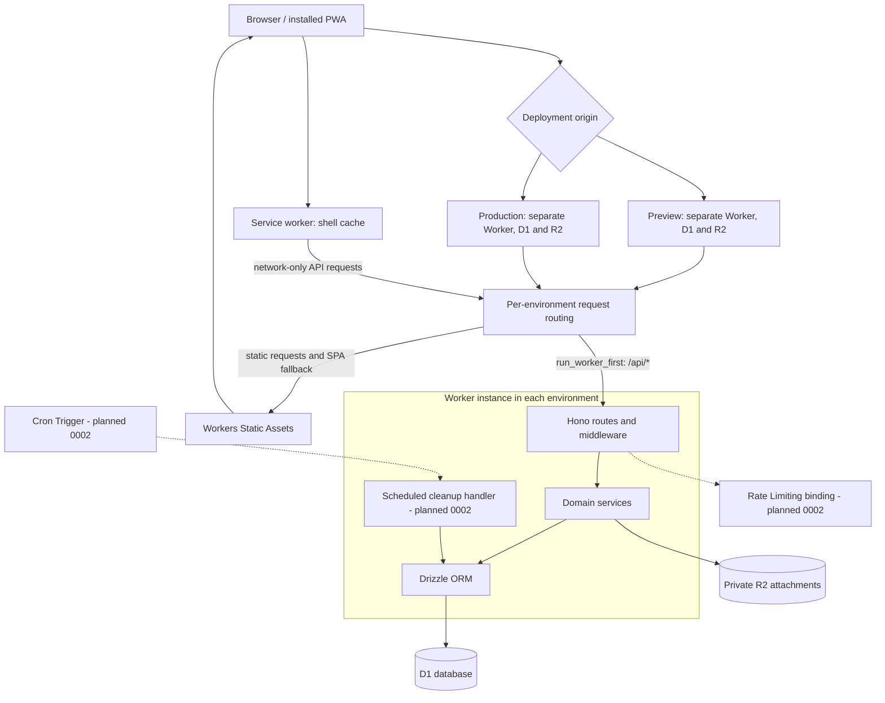

# Project Architecture

Pattern: monolith. One Cloudflare Worker serves the Hono API and the SPA through Workers Static Assets.

## Design Principles

### Principle 1

Description: isolate personal training data by user.  
Reasoning: explicit user IDs in services and queries keep personal endpoints within the authenticated account; [RBAC](../foundation.md#personas) defines exceptions.

### Principle 2

Description: one deployment is one team; all coaches share all athletes.  
Reasoning: `invited_by` records provenance rather than creating separate rosters or access boundaries.

### Principle 3

Description: coach responses contain only plan and aggregate data.  
Reasoning: private logs must never reach coaches. Currently `getCoachOverview` filters the full tracker result server-side. **Planned (work item 0002):** enforce the boundary at query level too, with dedicated plan and aggregate queries that never select private log columns (see [security](security.md#api-security)).

### Principle 4

Description: use single statements or D1 `batch()`, never `transaction()`, for atomic writes.  
Reasoning: D1 rejects interactive transactions. Bootstrap uses a conditional insert; invite claims and score/ends inserts use batches. R2 is outside D1 atomicity.

### Principle 5

Description: `src/db/schema.ts` is the schema source of truth.  
Reasoning: drizzle-kit generates SQL and snapshots; the no-diff check detects drift. Data-preserving rebuilds still require review under the [migration procedure](../devops/operations.md#ongoing-operations).

### Principle 6

Description: Cloudflare-native runtime APIs only.  
Reasoning: WebCrypto, D1 and R2 run in Workers without Node compatibility. Local test-runner compatibility does not permit Node APIs in application code.

### Principle 7

Description: the API is the source of truth; the PWA caches the shell.  
Reasoning: network-only API requests avoid stale training data and competing offline copies. There is no offline write queue or sync.

## High-level Architecture:

Each environment below is a separate instance of the same stack; bindings and deployment names are in [infrastructure](../devops/infrastructure.md).

## Major Components

### Component 1:

Name: Worker entry/router  
Purpose: route requests and normalize errors.  
Description and Scope: `src/index.ts` mounts `routes/auth.ts` at `/api/auth`, `routes/coach.ts` at `/api/coach`, and `routes/tracker.ts` plus `routes/transfer.ts` at `/api`. It exports `fetch`, with JSON not-found and unexpected-error handlers. `lib/http.ts` owns validators, integer parsing and download filename construction; no scheduled handler exists yet.

### Component 2:

Name: auth & sessions  
Purpose: credentials, invitations and access checks.  
Description and Scope: `lib/auth.ts` provides WebCrypto and cookies, `lib/rbac.ts` provides authentication and coach/athlete guards, and `services/auth.ts` owns account/session/invite persistence. Authentication joins sessions and users in one query. [Security](security.md) owns cryptographic and access-enforcement details.

### Component 3:

Name: rate limiting  
Purpose: bound authentication attempts.  
Description and Scope: `lib/rate-limit.ts` implements D1-backed middleware. Current limits, atomic counting and the planned replacement are in [security](security.md#rate-limiting).

### Component 4:

Name: tracker services  
Purpose: implement personal training operations.  
Description and Scope: `services/plan.ts`, `sessions.ts`, `scores.ts`, `maintenance.ts`, `setups.ts`, `inspiration.ts` and `dashboard.ts` take explicit account IDs. Shared schemas and date functions live in `lib/validation.ts` and `lib/dates.ts`.

The dashboard returns at most 100 sessions, ordered by date then ID descending, with [cursor pagination](apis.md#design). It returns at most 100 practice scores; ends are queried only for those IDs in groups of 50. SQL computes weekly arrow sums and distinct session dates from the first program cycle through the current cycle's end. Cycle summaries and other collections still grow with program/history size; this is not a constant-size payload guarantee.

New-state and starter-plan presentation is described in [experience](../uxui/experience.md#regular-usage). Maintenance insertion computes `MAX(sort_order)+1` within its insert; section clearing is one insert-select upsert. Score creation batches the parent and ends, locating the new parent through `sqlite_sequence` within the batch and checking its user ID rather than using global `max(id)`.

### Component 5:

Name: coach routes  
Purpose: shared team roster and athlete plan editing.  
Description and Scope: `routes/coach.ts` uses `services/team.ts`, the plan/attachment services and `dashboard.getCoachOverview`. Athlete-targeted calls require `resolveAthlete`. The overview exposes `state`, `weeklyPlans`, `plannedSessions`, `weeklyArrows` and `cycleSummaries`; its current query-level limitation is in Principle 3.

### Component 6:

Name: import/export  
Purpose: per-account data portability.  
Description and Scope: `routes/transfer.ts` delegates to `services/transfer.ts`; the [JSON format](../uxui/interface.md#usage) is version 1. Import deletes/reinserts the caller's D1 data in one batch, remaps IDs from global high-water marks, and deletes old R2 files **before** the batch. Insert chunks are sized from their generated SQL parameter count, at most 100 binds per statement, while the D1 replacement remains atomic. ID high-water queries are currently unscoped; they read maxima, not other users' records into the response. Concurrent ID collisions and loss of R2 files on failed imports remain possible.

**Planned (work item 0002):** remove global ID preallocation, delete replaced blobs only after successful D1 writes, and harden validation and overall import limits; see [security](security.md#planned-work-item-0002).

### Component 7:

Name: attachments (R2)  
Purpose: links, documents and photos on plan days.  
Description and Scope: `services/attachments.ts` stores link metadata in D1 and file bytes in R2 under user/UUID keys. Upload puts the blob then inserts metadata, attempting blob cleanup if insertion fails. Removal deletes the blob before its row. [Security](security.md#file-attachments) defines download checks and headers.

### Component 8:

Name: D1 schema & migrations  
Purpose: persistent relational state.  
Description and Scope: `db/index.ts` binds D1 to Drizzle, `db/schema.ts` declares tables/indexes, and `drizzle.config.ts` uses SQLite/d1-http with output in `migrations/`. `scripts/db-check.mjs` compares migration bytes before and after generation. Follow [operations](../devops/operations.md#ongoing-operations) for generation, review and application.

### Component 9:

Name: SPA  
Purpose: athlete and coach user interface.  
Description and Scope: `frontend/src/App.tsx` handles invite routing, auth gating, queries and tab mounts. Features live in `features/{auth,dashboard,log,plan,gear,fuel,team,settings}/`; shared UI is in `components/`, utilities in `lib/`, and `api.ts` is the typed fetch client. TanStack Query invalidation refreshes data after mutations; the UI does not make optimistic cache writes. Missing-row mutation responses trigger refetch and appropriate editor closure. Training history discards older pages after mutations and tracker refreshes, including an identical first page; a generation counter rejects responses started before that invalidation. See [interface](../uxui/interface.md).

### Component 10:

Name: service worker  
Purpose: cache the installable app shell.  
Description and Scope: `frontend/sw.js` is emitted by the Vite `serviceWorkerCache` plugin in `scripts/service-worker-cache.mjs` as `dist/client/sw.js`, registered only in production builds. After Vite writes the final output, the plugin hashes HTML, built JS/CSS, copied public files (manifest/icons), and service-worker source. A 12-hex content hash sets `dga-shell-<hash>`. Activation deletes all other caches, including legacy `dga-shell-v1`. Navigation is network-first with cached `index.html` fallback; `/assets/` is cache-first. Same-origin GETs only are intercepted, and `/api/*` is always excluded. File HTTP caching is separately described in [security](security.md#file-attachments).

## Data model summary

Source: [schema.ts](../../src/db/schema.ts).

| Group | Tables and relationships |
|---|---|
| Auth | `users`, `sessions`, `invites`, `rate_limits`. Users have UUID IDs, case-insensitive unique usernames, `role`, `is_owner` (default false) and nullable `invited_by`. A partial unique index permits at most one owner. Invites carry `role` (default athlete) and nullable `created_by`. |
| Tracker | `training_sessions`, `practice_scores`, `practice_score_ends`, `weekly_notes`, `bow_setups`, `milestone_checks`, `maintenance_checks`, `maintenance_items`, `inspiration_entries`. Each has `user_id`; score ends also reference their parent score. |
| Plan | `program_state`, `cycle_week_plans`, `planned_session_overrides`, `planned_session_attachments`. Each has `user_id`; plans use per-user week/day keys. Program poundage is nullable. |

Every `user_id` references `users(id) ON DELETE CASCADE`; score ends also cascade on score deletion. `users.invited_by` and `invites.created_by` reference users with `ON DELETE SET NULL`. R2 objects are not covered by SQL cascades. `rate_limits` has a key/window/attempt count rather than a user FK. The unused `entries` table has been removed. Migration/backfill behavior is documented in [operations](../devops/operations.md#ongoing-operations).

## Timestamp convention

Instants are epoch-millisecond SQLite integers mapped by Drizzle `timestamp_ms` to `Date`, including session/invite expiry. `rate_limits.window_start` deliberately remains a raw numeric epoch-ms counter anchor for arithmetic. Calendar dates are `YYYY-MM-DD` strings in the athlete's local calendar, supplied by the client as `today`. Helpers use UTC arithmetic to avoid DST drift; absent `today`, the API defaults to the server UTC date. Program `updated_at` is the calendar progression anchor. [API conventions](apis.md#design) describe wire encodings, including the invite-list exception.

New/default program state and initial poundage saves anchor to noon UTC on the client-supplied calendar day, keeping cycle 1/week 1 even when local Monday precedes UTC Monday. Existing and backfilled anchors remain unchanged. Schedule adjustments use the same calendar fallback.
